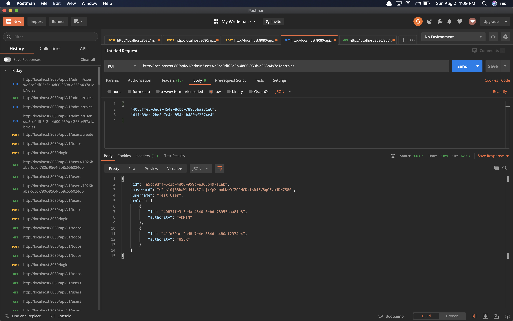

# Todo App

A REST API built to allow you to store and update your daily tasks. This project was build with `Java 11`, `The Spring Framework`, `Spring Boot`, `JPA`, `Spring Web`, `MySQL`, `Spring Security`, `Google Guava`, `JsonWebToken`, `Mockito`, `JUnit5`, `Lombok`, `Javax Validation`, `UUIDs`, `BCrypt`, and `Maven`.




## Getting Started

### Updates

#### Run These Files In Order:
- `TodoDB.sql`
- `TodoDBSeed.sql`

This will have ensured that you have the correct database and seed data neccessary for this application.

#### Change properties

In the `application.properties` file under the `main/` directory, update the following lines to match your `MySQL` credentials.

```
spring.datasource.username=root
spring.datasource.password=SGZ123SGZ
```

Finally, build and run the application using the IDE of your choice, and open `Postman` to access the endpoints.

## Built With

- [Java 11](https://www.oracle.com/java/technologies/javase-jdk11-downloads.html)
- [The Spring Framework](https://spring.io/)
- [Spring Boot](https://spring.io/projects/spring-boot)
- [JPA](https://www.oracle.com/java/technologies/persistence-jsp.html)
- [Spring Web](https://spring.io/guides/gs/serving-web-content/)
- [MySQL](https://www.mysql.com/)
- [Spring Security](https://spring.io/projects/spring-security)
- [Google Guava](https://github.com/google/guava)
- [JsonWebToken](https://jwt.io/)
- [Mockito](https://site.mockito.org/)
- [JUnit5](https://junit.org/junit5/)
- [Lombok](https://projectlombok.org/)
- [Javax Validation](https://docs.oracle.com/javaee/7/api/javax/validation/constraints/package-summary.html)
- [UUID](https://docs.oracle.com/javase/7/docs/api/java/util/UUID.html)
- [BCrypt](https://docs.spring.io/spring-security/site/docs/current/api/org/springframework/security/crypto/bcrypt/BCryptPasswordEncoder.html)
- [Maven](https://maven.apache.org/)

## Author
- **Sam G Zun** - [SZun](https://github.com/SZun)

